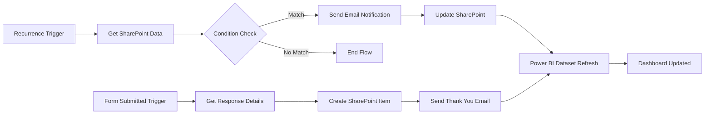

<!-- ========================= HEADER ========================= -->

# 🚀 Adarsh Kamble  
### Power Platform Developer | Automation Engineer | Data Analytics Professional  

---

## 👨‍💻 About This Repository

Welcome to my **Power Platform Automation Portfolio**.

This repository demonstrates real-world HR, Risk, and Survey automation systems built using Microsoft Power Platform.  
Each flow is designed with structured logic, scalability, and enterprise-readiness in mind.

I specialize in:

- Workflow Automation
- SharePoint Data Integration
- Microsoft Forms Automation
- Automated Email Notifications
- Dashboard-Driven Analytics using Power BI

---

# 📂 Automation Projects Overview

| Project | Type | Business Purpose |
|----------|------|-----------------|
| 🎉 Birthday Notification Flow | Scheduled | Employee Engagement |
| 🛡️ Fraud Prevention Flow | Scheduled Monitoring | Risk Alert System |
| 📊 Survey Distribution Flow | Quarterly Recurrence | Employee Feedback |
| 📩 Survey Response Processing | Event Triggered | Data Capture & Analytics |

---

# 🎉 1️⃣ Birthday Notification Automation

### 📌 Business Objective
Automatically send birthday or anniversary wishes to employees.

### ⚙️ Flow Type
Scheduled Cloud Flow (Daily Recurrence)

### 🛠 How Automation Works (Short Explanation)

1. Recurrence trigger runs daily  
2. Fetch employee data from SharePoint  
3. Loop through each employee  
4. Check if birthday or anniversary matches today's date  
5. If yes → Send automated email via Outlook  

### 🖼️ Flow Screenshot

### ✅ Business Impact
✔ No manual tracking  
✔ Improved company culture  
✔ Fully automated celebration system  

---

# 🛡️ 2️⃣ Fraud Prevention Monitoring Flow

### 📌 Business Objective
Automated fraud activity monitoring and alert notification.

### ⚙️ Flow Type
Scheduled Recurrence Flow

### 🛠 How Automation Works

1. Scheduled trigger runs at defined interval  
2. Monitors risk activity  
3. Sends alert email to stakeholders  
4. Ensures proactive fraud tracking  

### 🖼️ Flow Screenshot

)

### ✅ Business Value
✔ Compliance support  
✔ Risk alert automation  
✔ Reduced manual monitoring  

---

# 📊 3️⃣ Employee Satisfaction Survey – Distribution Flow

### 📌 Business Objective
Automatically send quarterly survey to employees.

### ⚙️ Flow Type
Quarterly Recurrence Flow

### 🛠 How Automation Works

1. Recurrence trigger (Quarterly)  
2. Send Microsoft Forms survey link via Outlook  
3. Ensure structured feedback cycle  

### 🖼️ Flow Screenshot

### ✅ Business Value
✔ Consistent feedback collection  
✔ Zero manual HR follow-up  
✔ Structured employee engagement  

---

# 📩 4️⃣ Survey Response Processing Flow

### 📌 Business Objective
Store survey responses automatically and send acknowledgment.

### ⚙️ Trigger
When new Microsoft Forms response is submitted

### 🛠 How Automation Works

1. Trigger when new form response submitted  
2. Get response details  
3. Create item in SharePoint list  
4. Send thank-you email to employee  
5. Power BI dashboard updates automatically  

### 🖼️ Flow Screenshot

### ✅ Business Value
✔ Automated data storage  
✔ Real-time dashboard update  
✔ Structured analytics pipeline  

---

# 🏗️ Enterprise Architecture Diagram (Animated)

> GitHub supports Mermaid diagrams for animated visualization.

---

# 📊 Data Flow Architecture (Survey System)

Microsoft Forms  
⬇  
Power Automate  
⬇  
SharePoint List  
⬇  
Power BI Dataset  
⬇  
Interactive Dashboard  

---

# 💡 Technical Skills Demonstrated

### 🔹 Power Automate
- Recurrence triggers  
- Conditional branching  
- Apply to each loops  
- Forms integration  
- SharePoint automation  
- Outlook email automation  

### 🔹 Data & Analytics
- SharePoint structured storage  
- Power BI integration  
- Automated refresh  
- KPI dashboard reporting  

---

# 📈 Business Outcomes Delivered

✔ 100% Automated HR Notifications  
✔ Structured Employee Feedback System  
✔ Fraud Monitoring Alert System  
✔ Real-Time Dashboard Visibility  
✔ Scalable Enterprise Workflow Design  

---

# 📬 Contact

📧 Email: adarshkamble120@gmail.com  
🔗 GitHub: https://github.com/Adarshkamble120/power-platform--automation-portfolio  
🔗 LinkedIn: https://www.linkedin.com/in/adarsh-kamble-6a983b224/

---

⭐ Open to opportunities in  
Power Platform Developer | Automation Engineer | Data Analyst Roles
